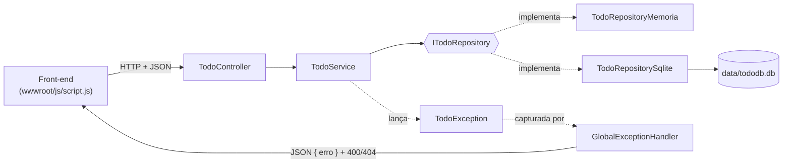

# Arquitetura do back-end — To-Do List em C#

Este documento explica como o back-end da To-Do List está organizado, por que ele foi construído dessa forma e o que faz cada classe, interface e método.

O projeto nasceu em **Java (Spring Boot)**, escrito no paradigma **imperativo**. Para a atividade de paradigmas de programação, o back-end foi reescrito em **C# (ASP.NET Core, .NET 8)** seguindo o paradigma **orientado a objetos (POO)**. O front-end (`wwwroot/`) **não foi alterado**: a API em C# expõe as mesmas rotas e o mesmo formato de JSON que a versão Java.

---

## Sumário

1. [Visão geral](#1-visão-geral)
2. [Estrutura de pastas](#2-estrutura-de-pastas)
3. [Fluxo de uma requisição](#3-fluxo-de-uma-requisição)
4. [Decisões de arquitetura (e por quê)](#4-decisões-de-arquitetura-e-por-quê)
5. [Referência de cada arquivo, classe e método](#5-referência-de-cada-arquivo-classe-e-método)
6. [Os pilares da POO no código](#6-os-pilares-da-poo-no-código)
7. [Equivalência Java → C#](#7-equivalência-java--c)
8. [Como executar](#8-como-executar)
9. [Como estender o projeto](#9-como-estender-o-projeto)

---

## 1. Visão geral

O back-end é uma **API REST** com quatro operações sobre tarefas:

| Método | Rota                 | O que faz                         | Resposta de sucesso          | Erros possíveis |
|--------|----------------------|-----------------------------------|------------------------------|-----------------|
| GET    | `/todos`             | Lista todas as tarefas            | `200` + lista de tarefas     | —               |
| POST   | `/todos`             | Cria uma tarefa                   | `200` + tarefa criada com id | `400` título inválido |
| PATCH  | `/todos/{id}/toggle` | Alterna concluída ↔ pendente      | `200` sem corpo              | `404` tarefa não encontrada |
| DELETE | `/todos/{id}`        | Remove uma tarefa                 | `200` sem corpo              | `404` tarefa não encontrada |

Uma tarefa trafega em JSON neste formato:

```json
{ "id": 1, "title": "Estudar", "completed": false, "weekday": "segunda", "priority": "high" }
```

Os erros são devolvidos como:

```json
{ "erro": "tarefa não encontrada" }
```

O mesmo servidor também entrega o front-end (arquivos estáticos de `wwwroot/`), então tudo roda em um único endereço: `http://localhost:8080`.

---

## 2. Estrutura de pastas

```
todolist-C#/
├── TodoList.csproj                 Definição do projeto e dependências
├── Program.cs                      Ponto de entrada: monta e inicia a aplicação
├── appsettings.json                Configurações (tipo de repositório, banco)
│
├── Models/
│   └── Todo.cs                     Entidade "tarefa"
│
├── Repositories/                   Camada de acesso a dados
│   ├── ITodoRepository.cs          Interface (contrato)
│   ├── TodoRepositoryMemoria.cs    Implementação em memória
│   └── TodoRepositorySqlite.cs     Implementação em banco SQLite
│
├── Services/                       Camada de regras de negócio
│   ├── TodoService.cs
│   └── Exceptions/
│       ├── TodoException.cs                   Classe base abstrata
│       ├── TituloInvalidoException.cs         → 400
│       └── TarefaNaoEncontradaException.cs    → 404
│
├── Controllers/                    Camada de entrada HTTP
│   └── TodoController.cs
│
├── Config/                         Configuração transversal
│   ├── GlobalExceptionHandler.cs   Converte exceções em respostas HTTP
│   └── RepositoryConfig.cs         Escolhe qual repositório usar
│
├── wwwroot/                        Front-end (inalterado)
│   ├── index.html
│   ├── css/style.css
│   └── js/script.js
│
└── docs/                           Documentação e apresentação
```

A pasta `data/`, onde fica o banco SQLite, é criada automaticamente ao executar o projeto. Ela está no `.gitignore`, assim como as pastas de compilação `bin/` e `obj/`.

---

## 3. Fluxo de uma requisição



**Exemplo: o usuário marca a checkbox de uma tarefa**

1. O `script.js` envia `PATCH /todos/3/toggle`.
2. O ASP.NET encontra a rota em `TodoController.AlternarStatus(3)`.
3. O controller repassa para `TodoService.AlternarStatus(3)`.
4. O serviço pede a tarefa ao repositório (`BuscarPorId(3)`):
   - se não existir, lança `TarefaNaoEncontradaException`;
   - se existir, chama `tarefa.AlternarStatus()` e salva o novo status com `AtualizarStatus(3, ...)`.
5. Sem erro, a resposta é `200`. Com erro, o `GlobalExceptionHandler` captura a exceção e devolve `404` com `{ "erro": "tarefa não encontrada" }`.

---

## 4. Decisões de arquitetura (e por quê)

### 4.1 Arquitetura em camadas (Controller → Service → Repository)

Cada camada tem **uma única responsabilidade**:

| Camada         | Responsabilidade                           | Não sabe nada sobre…           |
|----------------|--------------------------------------------|--------------------------------|
| **Controller** | Traduzir HTTP (rotas, JSON) em chamadas    | regras de negócio, banco       |
| **Service**    | Regras de negócio e validações             | HTTP, SQL                      |
| **Repository** | Guardar e buscar dados                     | HTTP, regras de negócio        |

**Por quê:** separar responsabilidades deixa o código mais fácil de entender, testar e alterar. Por exemplo, para trocar o banco de dados só é preciso mexer na camada de repositório. Essa também era a estrutura da versão Java, então o comportamento ficou idêntico e a comparação entre os paradigmas fica justa.

### 4.2 Programar para uma interface (`ITodoRepository`)

O `TodoService` não depende de uma classe concreta, mas da interface `ITodoRepository`.

**Por quê:** é o princípio da **inversão de dependência**. A regra de negócio, que é a parte mais importante, não fica presa a um detalhe técnico como "onde os dados são guardados". Assim, existem duas implementações intercambiáveis (memória e SQLite) e outras podem ser criadas sem tocar no serviço. Na prática, isso demonstra **abstração** e **polimorfismo**.

### 4.3 Injeção de dependência

Nenhuma classe cria suas dependências com `new`. Elas as recebem pelo **construtor**, e o contêiner de injeção de dependência do ASP.NET monta os objetos (configurado em `Program.cs` e `RepositoryConfig.cs`).

**Por quê:** reduz o acoplamento, facilita trocar implementações e permite testar cada classe isoladamente. É o equivalente ao que o Spring fazia na versão Java.

### 4.4 Serviços registrados como *singleton*

`TodoService` e o repositório são registrados como **uma única instância** para toda a aplicação.

**Por quê:** o repositório em memória **precisa** ser único, senão cada requisição veria uma lista vazia. O serviço não guarda estado próprio, então uma instância basta. É o mesmo comportamento padrão dos *beans* do Spring.

**Consequência:** como a mesma instância atende várias requisições ao mesmo tempo, o repositório em memória usa `lock` para evitar condições de corrida (veja a seção 5.4).

### 4.5 Encapsulamento real na entidade `Todo`

A classe `Todo` tem atributos privados e também **comportamentos**: `AlternarStatus()` e `PossuiTituloValido()`.

**Por quê:** na versão imperativa em Java, o serviço lia o status, invertia o valor e gravava. A lógica ficava **fora** do objeto. Em POO, quem conhece os dados deve conhecer as regras sobre eles. Isso evita que outras partes do sistema deixem o objeto em estado inconsistente.

### 4.6 Hierarquia de exceções com status HTTP polimórfico

As exceções de negócio herdam de uma classe abstrata `TodoException`, e cada uma informa seu próprio `StatusCode`.

**Por quê:** na versão Java havia um método de tratamento para cada exceção. Aqui, o `GlobalExceptionHandler` trata **qualquer** `TodoException` de uma só vez: cada exceção já sabe qual status representa. Para criar um novo tipo de erro, basta uma nova classe filha, sem alterar o tratador. Esse é o princípio **aberto/fechado**: aberto para extensão, fechado para modificação.

### 4.7 Tratamento de erros centralizado (filtro global)

O serviço apenas **lança** exceções e não sabe nada de HTTP. Um filtro global converte essas exceções em respostas HTTP.

**Por quê:** evita `try/catch` repetido em cada método do controller e mantém a camada de serviço independente da web.

### 4.8 SQLite com ADO.NET (no lugar de H2 com JDBC)

O H2 é um banco feito para Java e não tem versão para .NET. O **SQLite** cumpre o mesmo papel: banco embutido, gravado num arquivo local, sem instalar servidor. Para o acesso foi usado **ADO.NET** (`Microsoft.Data.Sqlite`), que é o equivalente direto do **JDBC**: conexão, comando SQL com parâmetros e leitura linha a linha.

**Por que não Entity Framework (ORM)?** Para manter a correspondência com a versão Java, que usava SQL escrito à mão com `JdbcTemplate`, e deixar visível o que acontece no banco. Um ORM esconderia o SQL e mudaria a comparação.

### 4.9 Escolha do repositório por configuração

A chave `Repositorio` no `appsettings.json` define qual implementação usar: `banco` (padrão) ou `memoria`.

**Por quê:** substitui os *profiles* do Spring (`@Profile("memoria")` / `@Profile("jdbc")`). Dá para trocar o comportamento sem recompilar, inclusive por variável de ambiente.

### 4.10 Front-end intacto

As rotas, os métodos HTTP e os nomes dos campos JSON (`id`, `title`, `completed`, `weekday`, `priority`) são os mesmos da versão Java. O ASP.NET já converte as propriedades C# (`Title`) para *camelCase* no JSON (`title`).

**Por quê:** a atividade pedia que só o back-end mudasse de paradigma.

---

## 5. Referência de cada arquivo, classe e método

### 5.1 `Program.cs` — ponto de entrada

Monta e inicia a aplicação. Usa o estilo *top-level statements* do C#, sem precisar declarar uma classe `Program` com `Main`.

| Trecho | O que faz |
|---|---|
| `WebApplication.CreateBuilder(args)` | Cria o construtor da aplicação e lê `appsettings.json` e as variáveis de ambiente. |
| `Environment.GetEnvironmentVariable("PORT") ?? "8080"` | Lê a porta da variável `PORT`; se não existir, usa 8080 (igual ao `server.port=${PORT:8080}` do Java). |
| `builder.WebHost.UseUrls(...)` | Faz o servidor escutar nessa porta. |
| `AddControllers(options => options.Filters.Add<GlobalExceptionHandler>())` | Habilita os controllers e registra o filtro global de exceções. |
| `builder.Services.AdicionarRepositorio(builder.Configuration)` | Registra a implementação de `ITodoRepository` escolhida na configuração (veja 5.11). |
| `builder.Services.AddSingleton<TodoService>()` | Registra o serviço como instância única. |
| `app.UseDefaultFiles()` | Faz `/` entregar o `index.html`. |
| `app.UseStaticFiles()` | Serve os arquivos de `wwwroot/` (HTML, CSS, JS). |
| `app.MapControllers()` | Liga as rotas declaradas nos controllers (`/todos`). |
| `app.Run()` | Inicia o servidor. |

---

### 5.2 `Models/Todo.cs` — classe `Todo`

Representa **uma tarefa**. É a entidade central do sistema.

**Atributos (privados):**

| Atributo | Tipo | Significado |
|---|---|---|
| `_id` | `int?` | Identificador. É `null` enquanto a tarefa ainda não foi salva. |
| `_title` | `string?` | Título da tarefa. |
| `_completed` | `bool` | Se a tarefa está concluída. |
| `_weekday` | `string?` | Dia da semana em que a tarefa aparece (`segunda`, `terça`…). |
| `_priority` | `string?` | Prioridade (`low`, `medium`, `high`), usada como classe CSS no front-end. |

> Os campos de texto são `string?` (podem ser nulos) de propósito. Com os *nullable reference types* ligados, um `string` não-nulo faria o ASP.NET rejeitar automaticamente um JSON sem `title`, com uma mensagem genérica. Deixando anulável, quem valida é o próprio domínio (`PossuiTituloValido`), que devolve a mensagem `"título inválido"`, igual à versão Java.

**Construtores:**

| Construtor | Uso |
|---|---|
| `Todo()` | Construtor vazio. Usado pelo ASP.NET para montar o objeto a partir do JSON recebido. |
| `Todo(int? id, string? title, string? weekday, string? priority, bool completed)` | Cria a tarefa já preenchida. Usado pelo repositório SQLite ao ler uma linha do banco. |

**Propriedades:** `Id`, `Title`, `Completed`, `Weekday`, `Priority`.
Cada uma tem `get` e `set` que leem e gravam o atributo privado correspondente. São o equivalente aos *getters* e *setters* do Java (`getTitle()`, `setTitle()`), com sintaxe mais enxuta. Também são elas que o ASP.NET usa para converter o objeto de e para JSON.

**Métodos:**

| Método | Retorno | O que faz |
|---|---|---|
| `PossuiTituloValido()` | `bool` | Retorna `true` se o título não for nulo, vazio ou só espaços. A regra de validação fica dentro da própria entidade. |
| `AlternarStatus()` | `void` | Inverte `_completed`: concluída ↔ pendente. |
| `ToString()` | `string` | Sobrescreve (`override`) o método herdado de `object` e devolve um texto legível, útil para depuração. |

---

### 5.3 `Repositories/ITodoRepository.cs` — interface `ITodoRepository`

Define o **contrato** de acesso a dados: *o que* um repositório precisa saber fazer, sem dizer *como*.

| Método | O que deve fazer |
|---|---|
| `Todo Salvar(Todo todo)` | Guarda uma nova tarefa, atribui um `Id` e devolve a tarefa salva. |
| `List<Todo> ListarTodos()` | Devolve todas as tarefas. |
| `void AtualizarStatus(int id, bool completed)` | Grava o novo status de conclusão da tarefa. |
| `void Remover(int id)` | Apaga a tarefa. |
| `Todo? BuscarPorId(int id)` | Devolve a tarefa com esse id, ou `null` se não existir. |

> **Diferença para o Java:** lá, `buscarPorId` retornava `Optional<Todo>`. Em C#, o `?` em `Todo?` já indica que o valor pode faltar, e o compilador avisa se o `null` não for tratado.

---

### 5.4 `Repositories/TodoRepositoryMemoria.cs` — classe `TodoRepositoryMemoria`

Implementa `ITodoRepository` guardando as tarefas **em uma lista na memória**. Os dados somem quando a aplicação é reiniciada. É útil para testes e demonstrações.

**Atributos:**

| Atributo | Para que serve |
|---|---|
| `_tarefas` (`List<Todo>`) | A lista de tarefas. |
| `_trava` (`object`) | Objeto usado no `lock` para garantir que só uma requisição por vez mexa na lista. |
| `_proximoId` (`int`) | Contador que gera ids sequenciais (1, 2, 3…), como o `AUTO_INCREMENT` de um banco. |

**Métodos:** todos executam dentro de `lock (_trava) { ... }`.

| Método | Como faz |
|---|---|
| `Salvar(todo)` | Atribui `_proximoId` ao `Id` da tarefa, incrementa o contador, adiciona a tarefa na lista e a devolve. |
| `ListarTodos()` | Devolve uma **cópia** da lista (`new List<Todo>(_tarefas)`), para que quem recebe não altere a lista interna nem a percorra enquanto outra requisição a modifica. |
| `AtualizarStatus(id, completed)` | Procura a tarefa com `FirstOrDefault` e, se encontrar, altera `Completed`. |
| `Remover(id)` | Remove da lista a tarefa com esse id (`RemoveAll`). |
| `BuscarPorId(id)` | Devolve a primeira tarefa com esse id, ou `null`. |

> **Por que o `lock`?** O ASP.NET atende várias requisições em paralelo, e `List<T>` não é segura para acesso simultâneo. Sem o `lock`, duas criações ao mesmo tempo poderiam receber o mesmo id ou corromper a lista. A versão Java não tinha essa proteção.

---

### 5.5 `Repositories/TodoRepositorySqlite.cs` — classe `TodoRepositorySqlite`

Implementa `ITodoRepository` gravando em um **banco SQLite** (arquivo `data/tododb.db`) via ADO.NET. Os dados permanecem entre reinicializações. É o equivalente ao `TodoRepositoryJdbc` + `schema.sql` da versão Java.

**Constante e atributo:**

| Membro | Para que serve |
|---|---|
| `Schema` (`const string`) | SQL que cria a tabela `todos` se ela ainda não existir (o antigo `schema.sql`). |
| `_connectionString` | Texto de conexão com o banco, por exemplo `Data Source=data/tododb.db`. |

**Construtor:** `TodoRepositorySqlite(string connectionString)` guarda a string de conexão e chama `CriarTabela()`. O banco fica pronto assim que a aplicação sobe.

**Métodos públicos (do contrato):**

| Método | SQL executado | Detalhes |
|---|---|---|
| `Salvar(todo)` | `INSERT INTO todos (...) VALUES (...) RETURNING id` | O `RETURNING id` devolve o id gerado na mesma operação (no Java era usado `KeyHolder`). Se `Priority` for nula, grava `NULL` (`DBNull.Value`). |
| `ListarTodos()` | `SELECT * FROM todos` | Lê todas as linhas e as converte em objetos `Todo`. |
| `AtualizarStatus(id, completed)` | `UPDATE todos SET completed = $completed WHERE id = $id` | |
| `Remover(id)` | `DELETE FROM todos WHERE id = $id` | |
| `BuscarPorId(id)` | `SELECT * FROM todos WHERE id = $id` | Devolve a primeira linha encontrada ou `null`. |

**Métodos privados (auxiliares, encapsulados):**

| Método | O que faz |
|---|---|
| `AbrirConexao()` | Cria e abre uma `SqliteConnection`. Cada operação abre a sua e a fecha ao terminar, graças ao `using`. |
| `CriarTabela()` | Executa o `Schema`. |
| `LerTarefas(comando)` | Executa o comando, percorre o resultado linha por linha (`SqliteDataReader`) e monta a lista de `Todo`. |
| `MapearTarefa(leitor)` | Converte **uma linha** do banco em um objeto `Todo`, tratando `priority` e `completed` nulos. Equivale ao `RowMapper` do Java. |

> **Segurança:** todos os valores entram no SQL como **parâmetros** (`$title`, `$id`…), nunca concatenados no texto da consulta. Isso impede ataques de *SQL injection*.
>
> **`using`:** garante que conexão, comando e leitor sejam fechados mesmo se ocorrer um erro, como o `try-with-resources` do Java.
>
> **Booleano no SQLite:** o SQLite não tem um tipo booleano de verdade e grava `completed` como `0` ou `1`. O ADO.NET faz essa conversão automaticamente.

---

### 5.6 `Services/Exceptions/TodoException.cs` — classe abstrata `TodoException`

Classe base de **todas as exceções de negócio** do sistema. Herda de `Exception`, a classe de exceção do .NET.

| Membro | O que é |
|---|---|
| `protected TodoException(string mensagem) : base(mensagem)` | Construtor `protected`: só as classes filhas podem chamá-lo. Ele repassa a mensagem para `Exception`. |
| `public abstract int StatusCode { get; }` | Propriedade **abstrata**: não tem implementação aqui, e cada filha é **obrigada** a dizer qual status HTTP representa. |

Por ser `abstract`, a classe não pode ser instanciada diretamente (`new TodoException(...)` não compila). Ela existe apenas para ser herdada.

---

### 5.7 `Services/Exceptions/TituloInvalidoException.cs`

```csharp
public class TituloInvalidoException : TodoException
```

Lançada quando se tenta criar uma tarefa sem título.

| Membro | O que faz |
|---|---|
| Construtor `TituloInvalidoException(string mensagem)` | Repassa a mensagem para a classe mãe (`: base(mensagem)`). |
| `override int StatusCode` | Retorna `400` (*Bad Request*): o cliente enviou dados inválidos. |

---

### 5.8 `Services/Exceptions/TarefaNaoEncontradaException.cs`

```csharp
public class TarefaNaoEncontradaException : TodoException
```

Lançada quando se tenta alterar ou remover uma tarefa que não existe.

| Membro | O que faz |
|---|---|
| Construtor `TarefaNaoEncontradaException(string mensagem)` | Repassa a mensagem para a classe mãe. |
| `override int StatusCode` | Retorna `404` (*Not Found*). |

---

### 5.9 `Services/TodoService.cs` — classe `TodoService`

Concentra as **regras de negócio**. É chamado pelo controller e usa o repositório.

**Atributo:** `_repository` (`ITodoRepository`, `readonly`). É o repositório recebido no construtor. É `readonly` porque não pode ser trocado depois que o serviço é criado.

**Construtor:** `TodoService(ITodoRepository repository)` recebe o repositório por injeção de dependência. O serviço não sabe qual implementação recebeu.

**Métodos públicos:**

| Método | Regra aplicada |
|---|---|
| `CriarTarefa(todo)` | Se `todo.PossuiTituloValido()` for falso, lança `TituloInvalidoException("título inválido")`. Senão, salva no repositório e devolve a tarefa com id. |
| `ListarTarefas()` | Devolve todas as tarefas do repositório. |
| `RemoverTarefa(id)` | Garante que a tarefa existe (senão lança `TarefaNaoEncontradaException`) e então a remove. |
| `AlternarStatus(id)` | Busca a tarefa (ou lança `TarefaNaoEncontradaException`), chama `tarefa.AlternarStatus()` e grava o novo valor com `_repository.AtualizarStatus(id, tarefa.Completed)`. |

**Método privado:**

| Método | O que faz |
|---|---|
| `BuscarTarefaExistente(id)` | Busca a tarefa e, se o resultado for `null`, lança `TarefaNaoEncontradaException("tarefa não encontrada")`. Usa o operador `??` com `throw`. Elimina a verificação que se repetia em dois métodos na versão Java. |

> **Por que gravar com `AtualizarStatus` depois de `tarefa.AlternarStatus()`?** No repositório em memória, o objeto devolvido é o mesmo que está na lista, então a alteração já valeria. No SQLite, porém, o objeto é uma cópia lida do banco, e é preciso gravar a mudança. Chamar sempre `AtualizarStatus` faz o serviço funcionar igual com **qualquer** implementação, sem depender de como cada uma funciona por dentro.

---

### 5.10 `Controllers/TodoController.cs` — classe `TodoController`

Recebe as requisições HTTP e as encaminha para o serviço. Não contém regra de negócio.

**Atributos de classe (anotações):**

| Atributo | Efeito |
|---|---|
| `[ApiController]` | Ativa comportamentos de API: lê o corpo da requisição como JSON e devolve os resultados em JSON. |
| `[Route("todos")]` | Todas as rotas da classe começam com `/todos`. |

A classe herda de `ControllerBase`, a classe base do ASP.NET para controllers de API.

**Construtor:** `TodoController(TodoService service)` recebe o serviço por injeção de dependência.

**Métodos (endpoints):**

| Método C# | Rota | O que faz |
|---|---|---|
| `[HttpGet] Listar()` | `GET /todos` | Devolve `_service.ListarTarefas()`, convertido em JSON. |
| `[HttpPost] Criar([FromBody] Todo todo)` | `POST /todos` | `[FromBody]` monta o `Todo` a partir do JSON enviado. Devolve a tarefa criada, já com id. |
| `[HttpPatch("{id}/toggle")] AlternarStatus(int id)` | `PATCH /todos/{id}/toggle` | O `{id}` da URL vira o parâmetro `id`. Retorna `void`, ou seja, `200` sem corpo. |
| `[HttpDelete("{id}")] Remover(int id)` | `DELETE /todos/{id}` | Remove a tarefa. Retorna `200` sem corpo. |

---

### 5.11 `Config/RepositoryConfig.cs` — classe estática `RepositoryConfig`

Decide **qual implementação** de `ITodoRepository` será usada.

**Método:** `AdicionarRepositorio(this IServiceCollection services, IConfiguration configuration)`

É um **método de extensão** (repare no `this` no primeiro parâmetro). Por isso pode ser chamado como se fosse um método da própria coleção de serviços: `builder.Services.AdicionarRepositorio(...)`. Ele:

1. Lê a chave `Repositorio` da configuração (padrão: `"banco"`).
2. Se for `"memoria"`, registra `TodoRepositoryMemoria` como *singleton*.
3. Caso contrário:
   - lê a *connection string* `TodoDb` (padrão: `Data Source=data/tododb.db`);
   - cria a pasta `data/` se não existir;
   - registra uma instância de `TodoRepositorySqlite`.
4. Devolve a coleção, o que permite encadear outras chamadas.

---

### 5.12 `Config/GlobalExceptionHandler.cs` — classe `GlobalExceptionHandler`

Implementa `IExceptionFilter`, uma interface do ASP.NET para filtros executados quando um controller lança uma exceção. É o equivalente ao `@RestControllerAdvice` do Spring.

**Método:** `OnException(ExceptionContext context)`

1. Verifica se a exceção é uma `TodoException` (`is TodoException excecao`).
2. Se for, monta a resposta:
   - corpo: `{ "erro": "<mensagem da exceção>" }`;
   - status: `excecao.StatusCode`. Aqui está o **polimorfismo**: o filtro não sabe qual exceção específica recebeu, e cada uma responde com seu próprio código (400 ou 404).
3. Marca `context.ExceptionHandled = true` para o ASP.NET não tratá-la de novo.

Qualquer outra exceção (um erro inesperado) segue para o tratamento padrão do ASP.NET, que responde `500`.

---

### 5.13 `appsettings.json`

```json
{
  "Repositorio": "banco",
  "ConnectionStrings": { "TodoDb": "Data Source=data/tododb.db" }
}
```

| Chave | Valores | Efeito |
|---|---|---|
| `Repositorio` | `banco` / `memoria` | Escolhe a implementação do repositório. |
| `ConnectionStrings:TodoDb` | caminho do arquivo | Onde fica o banco SQLite. |

Qualquer chave pode ser sobrescrita por variável de ambiente, por exemplo `Repositorio=memoria dotnet run`.

### 5.14 `TodoList.csproj`

Define o projeto (equivalente ao `pom.xml`):

- `Microsoft.NET.Sdk.Web`: projeto web do ASP.NET Core.
- `net8.0`: versão do .NET (LTS, com suporte de longo prazo).
- `Nullable` habilitado: o compilador avisa sobre possíveis `null` não tratados.
- `ImplicitUsings` habilitado: `using`s comuns (`System`, `System.Linq`…) já vêm incluídos.
- Dependência única: `Microsoft.Data.Sqlite`, o driver ADO.NET do SQLite.

---

## 6. Os pilares da POO no código

| Pilar | Onde aparece | Como |
|---|---|---|
| **Encapsulamento** | `Todo`, `TodoRepositorySqlite`, `TodoService` | Atributos privados acessados por propriedades. Regras dentro do objeto (`AlternarStatus`, `PossuiTituloValido`). Métodos auxiliares `private` escondem detalhes internos (`AbrirConexao`, `MapearTarefa`, `BuscarTarefaExistente`). |
| **Abstração** | `ITodoRepository`, `TodoException` | A interface define *o que* fazer sem dizer *como*. A classe abstrata define o que toda exceção de negócio tem. |
| **Herança** | Exceções; `TodoController : ControllerBase` | `TituloInvalidoException` e `TarefaNaoEncontradaException` herdam de `TodoException`, que herda de `Exception`. O controller herda funcionalidades do ASP.NET. |
| **Polimorfismo** | `_repository.X(...)` no serviço; `excecao.StatusCode` no filtro; `ToString()` | A mesma chamada executa código diferente conforme o objeto real: memória ou SQLite; 400 ou 404. `override` de `ToString` e de `StatusCode`. |

---

## 7. Equivalência Java → C#

| Java (Spring Boot) | C# (ASP.NET Core) | Observação |
|---|---|---|
| `TodolistApplication.main` | `Program.cs` | |
| `application.properties` / `-jdbc` / `-memoria` | `appsettings.json` | Os *profiles* viraram a chave `Repositorio`. |
| `pom.xml` | `TodoList.csproj` | |
| `Todo` com `getX()` / `setX()` | `Todo` com propriedades `{ get; set; }` | Ganhou os métodos `AlternarStatus` e `PossuiTituloValido`. |
| `interface TodoRepository` | `interface ITodoRepository` | Em C#, interfaces começam com `I` por convenção. |
| `Optional<Todo>` | `Todo?` | |
| `TodoRepositoryMemoria` | `TodoRepositoryMemoria` | Ganhou `lock` para acesso concorrente. |
| `TodoRepositoryJdbc` + `JdbcTemplate` + H2 | `TodoRepositorySqlite` + ADO.NET + SQLite | |
| `schema.sql` | constante `Schema` | Executada no construtor. |
| `KeyHolder` | `RETURNING id` | |
| `@Service` | `AddSingleton<TodoService>()` | |
| `@Configuration` + `@Bean` + `@Profile` | `RepositoryConfig.AdicionarRepositorio` | |
| `@RestController` + `@RequestMapping` | `[ApiController]` + `[Route]` | |
| `@GetMapping`, `@PostMapping`… | `[HttpGet]`, `[HttpPost]`… | |
| `@PathVariable` / `@RequestBody` | parâmetro da rota / `[FromBody]` | |
| `RuntimeException` | `TodoException` (abstrata) → `Exception` | Ganhou o `StatusCode` polimórfico. |
| `@RestControllerAdvice` + um `@ExceptionHandler` por exceção | `IExceptionFilter` com um único tratamento | |
| `src/main/resources/static/` | `wwwroot/` | Mesmo conteúdo, sem alterações. |

---

## 8. Como executar

Pré-requisito: [.NET 8 SDK](https://dotnet.microsoft.com/download). Confira com `dotnet --version`.

```bash
cd todolist-C#
dotnet run
```

Depois, abra `http://localhost:8080`.

Variações:

```bash
Repositorio=memoria dotnet run   # guarda as tarefas só em memória
PORT=5000 dotnet run             # muda a porta
```

Para testar a API sem o front-end:

```bash
curl -X POST http://localhost:8080/todos -H "Content-Type: application/json" \
     -d '{"title":"Estudar","completed":false,"weekday":"segunda","priority":"high"}'
curl http://localhost:8080/todos
curl -X PATCH http://localhost:8080/todos/1/toggle
curl -X DELETE http://localhost:8080/todos/1
```

---

## 9. Como estender o projeto

A arquitetura foi pensada para crescer **sem modificar** o que já funciona:

- **Novo tipo de armazenamento** (por exemplo, PostgreSQL ou arquivo JSON): crie uma classe que implemente `ITodoRepository` e adicione uma opção em `RepositoryConfig`. O `TodoService` e o controller não mudam.
- **Novo erro de negócio** (por exemplo, "tarefa duplicada" → `409`): crie uma classe que herde de `TodoException` e sobrescreva `StatusCode`. O `GlobalExceptionHandler` já a trata automaticamente.
- **Nova regra sobre a tarefa** (por exemplo, limitar o tamanho do título): coloque-a na classe `Todo` (como em `PossuiTituloValido`) ou no `TodoService`, conforme pertença ao objeto ou ao processo.
- **Nova rota**: adicione um método no `TodoController` que chame um novo método do `TodoService`.
